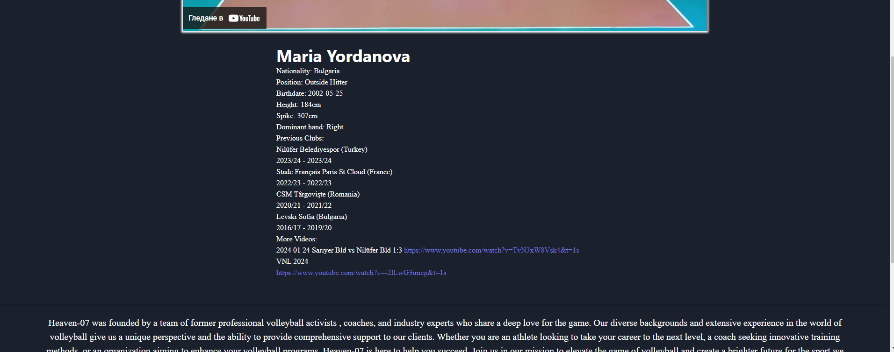
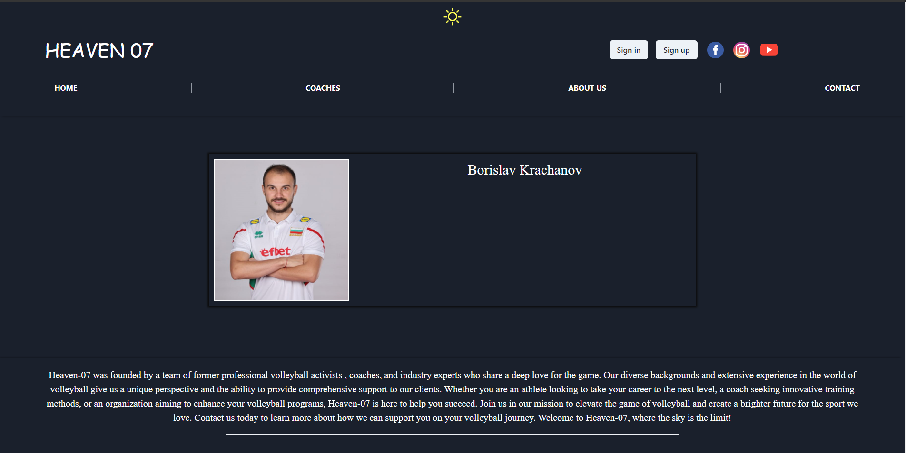

# Voleyball team

 This project is a hosted live website for the voleyball organisation Heaven-07. It works as a porftolio if somebody wants to get familiar with the organisation's players, coaches, staff and purposes.

 You can access the website live here [Heaven 07](https://www.heaven-07.com/).

 ## Features

 ### Public part
  
  - **Sign in / Sign up :**

    In Sign in a user can get into their account if they already created one. In Sign up a user can create an account if they haven't yet.
 

 - **Home page :** 

 Home page displays the organization's athletes. When a user hovers over an atheles's picture a **View profile** button appears, which when clicked navigates to a **detailed page** of the clicked athlete.
 
 - **Detailed athlete page :**
  
  The page contains a video highlight of the athlete and the athlete's description placed under the video.
 
- **Coaches :**

Coaches page visualises the coaches of the organization.Same as the athelete's pictures, when a coach's picture is hovered a **View profile** button appears which when clicked visualises the specified coach's **detailed page**

- **Detailed coach page :**

The page contains the coach's picture in bigger size and the coach's description in the form of text.

- **About us :**

About us page is the page where u can learn eveyrthing about Heaven-07.

- **Contact / Contact us:**

Contact page is where you can directly send a message to the organization by filling the 3 input fields (**Name**, **Email** and **Message**) and completing the **reCaptcha** which prevents spam.

  

### Administrative part
An authenticated user with admin role has the following features : 

- **Home :** 

1. At the home page admin can directly delete an athlete from the realtime database by clicking on a button **Delete** which will appear on the hovered athlete under the **View profile** button.
  
2. Admin can also create a new athlete which will be added to the realtime database by clicking on the button **Add new athlete** and filling the form.

- **Detailed athlete page :**

A user with admin role can directly delete the video of the athlete and add a new one or change the description.

- **Coaches :**

The functionality in this page is the same as in **Home** but for coaches.

- **Detailed coach page :**
As the coach has only description in the detailed page the admin can only manipulate the description.

### Changing theme

The user can change the theme between light and dark by clicking on the moon or sun (depends which one the user has at the moment).

## Technologies 

- React: Used for building the user interface.
- Chakra UI: Used for styling the components.
- Firebase: Used for authentication and storing data in a NoSQL database.
